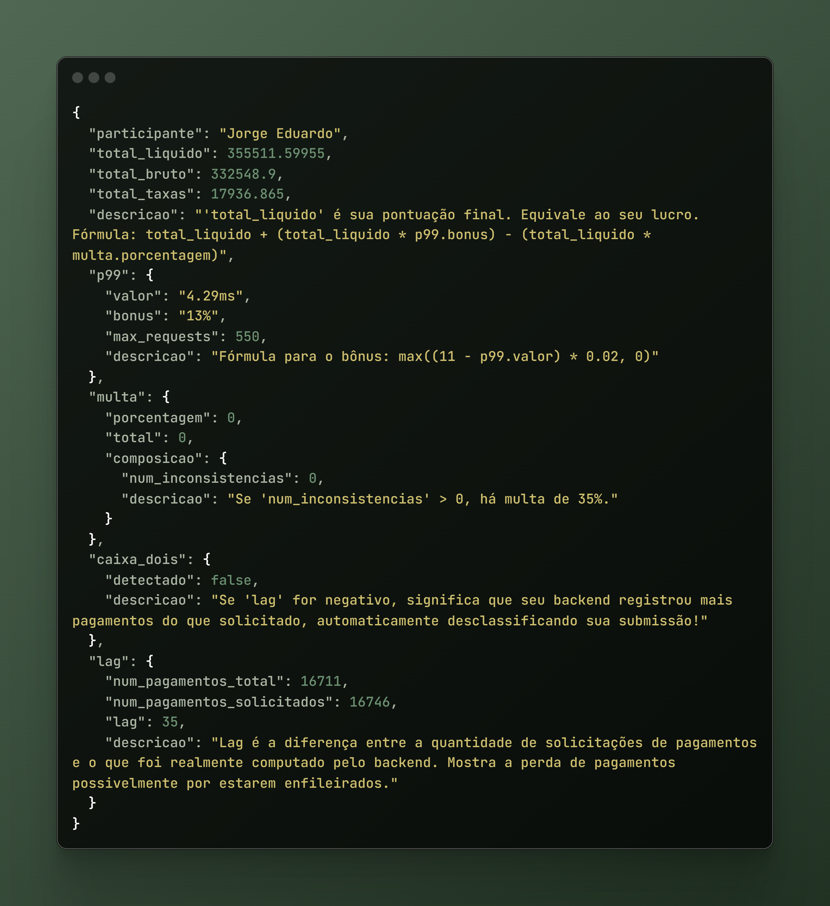
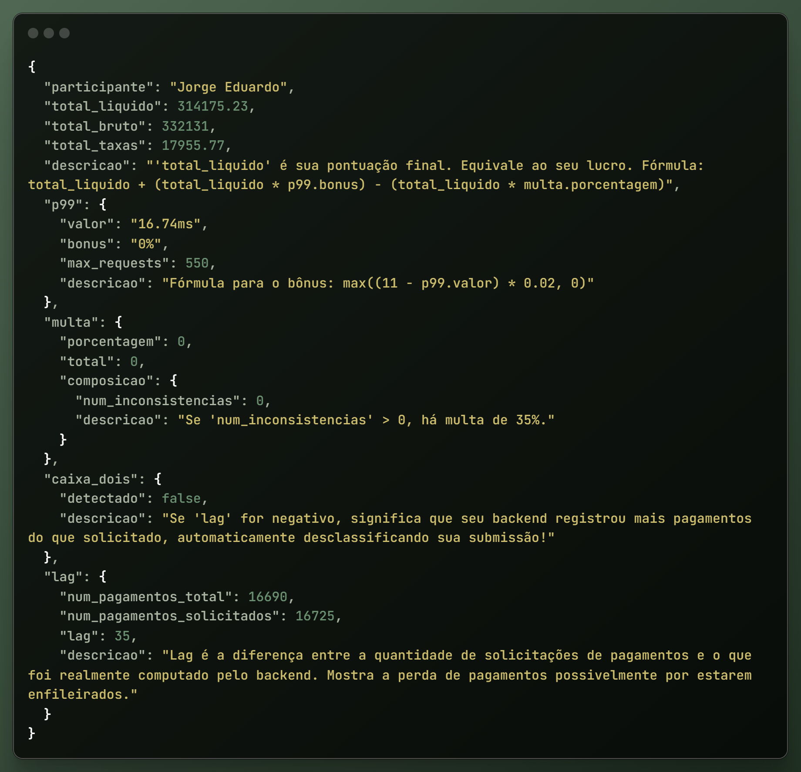

# Rinha de Backend 2025

API da Rinha de Backend 2025 desenvolvida em **Java com Spring Boot**, empacotada como imagem nativa com **GraalVM 24**.

## 🚀 Tecnologias

- **Java 21**
- **Spring Boot**
- **GraalVM 24 Native Image**
- **Docker & Docker Compose**
- **HAProxy** (load balancer)


## 🎯 Descrição

Este projeto é uma API REST, preparada para alta performance e inicialização rápida usando GraalVM Native Image. Em ambiente de container, utiliza Docker Compose para orquestração e HAProxy como balanceador de carga.


## 📦 Pré-requisitos

- Docker
- Docker Compose


## 🐳 Executando com Docker Compose

1. Clone este repositório:
   ```bash
   git clone https://github.com/seu-usuario/rinha-backend.git
   cd rinha-backend
   ```
2. Iniciar com Docker compose:  
   ```bash
   docker-compose -f docker-compose.yml -f docker-compose-rinha.yml up -d
   ```
  
   - `docker-compose.yml`: serviços básicos da aplicação e dependências.
   - `docker-compose-rinha.yml`: configurações específicas da rinha (HAProxy, redes, volumes).

## ⚙️ Testes com k6

Após clonar o repositório de testes, siga estes passos:
   ```bash
   cd rinha-test
   k6 run rinha.js 
   ```
Isso gerará o arquivo partial-results.json com os resultados. É necessário ter o k6 instalado na sua máquina.

## Resultados

   Com base na regulamentação da Rinha de Backend 2025, o uso total de CPU não poderia ultrapassar 1.5 cores, e o consumo de memória RAM deveria permanecer abaixo de 350 MB.

   Utilizando GraalVM, consegui reduzir drasticamente o uso de memória ao compilar a aplicação diretamente para binário nativo, eliminando classes e pacotes não utilizados no empacotamento final. Com isso, 
   cada instância da API consome apenas 110 MB de RAM e 0.65 de CPU. O HAProxy complementa com 35 MB de RAM e 0.20 de CPU, totalizando 255 MB de memória RAM, ou seja, 95 MB abaixo do limite, representando 
   uma redução de cerca de 27% em relação aos testes iniciais.

   Nos primeiros testes, a aplicação apresentava 200 inconsistências. Após ajustes finos, especialmente na concorrência com virtual threads, atingi zero inconsistências na solução final — uma redução de 100%.

   Em termos de desempenho, o P99 no ambiente local era de 18 ms no início. Com ajustes no sistema e melhorias no backend, atingi um P99 de 4 ms, ou seja, 99% das requisições respondem em até 4 ms. 
   Isso representa uma melhora de aproximadamente 77% no tempo de resposta.

   Utilizando WSL com Docker, os primeiros testes apresentaram um P99 entre 70 ms e 90 ms, impactado principalmente pela restrição de CPU, que limitava bastante o desempenho. Após ajustes no sistema e otimizações 
   no backend, consegui reduzir o P99 para uma faixa entre 16 ms e 20 ms, representando uma melhora de aproximadamente 77,5%.

   dVale destacar que o WSL impõe limitações de desempenho significativas. Infelizmente, não tive a oportunidade de testar diretamente em um ambiente Linux nativo, onde os resultados provavelmente seriam ainda melhores.

### 1. Resultado dos testes executados localmente utilizando apenas uma instância da aplicação.

   
 
### 2. Resultado dos testes executados localmente utilizando nginx como load balancer e duas instância da aplicação.

      

### 3. Resultado dos testes executados utilizando Docker, haproxy e duas instâncias da aplicação empacotadas com Maven em GraalVM 24 (foi utilizado WSL, o que reduz drasticamente o desempenho).

     

## ⚙️ HAProxy

O HAProxy faz balanceamento de carga entre instâncias da API:

- Configuração: `haproxy.cfg`
- Serviço: `haproxy` no Docker Compose

